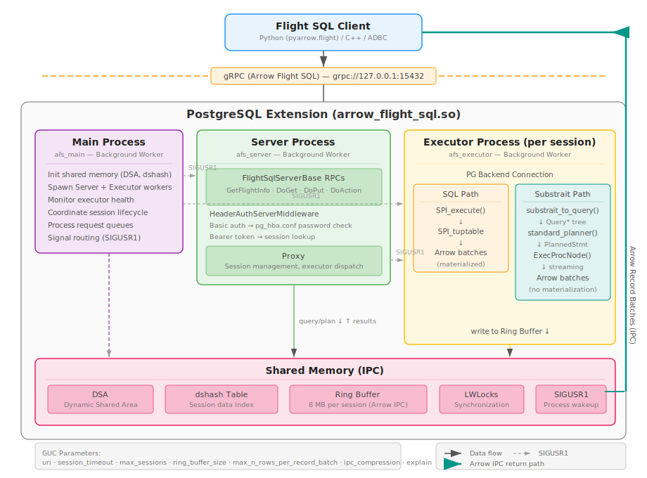
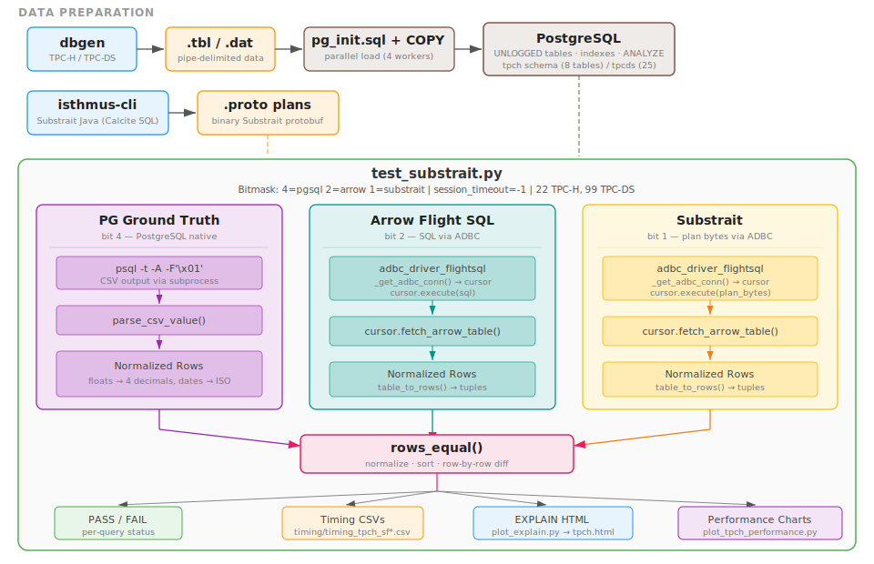

# Apache Arrow Flight SQL + Substrait Adapter for PostgreSQL

PostgreSQL extension that serves SQL queries, [Substrait][substrait] plans, and bidirectional data exchange (`DoExchange`) over [Arrow Flight SQL][flight-sql]. Substrait plans are converted to PostgreSQL Query trees and executed via `standard_planner`. Includes an FDW for querying remote Flight SQL servers.

```
Client (ADBC) → gRPC → {SQL | Substrait | DoExchange} → PG executor → Arrow batches
```

## Architecture



## Substrait Support

### Relation Types

| Relation | Notes |
|---|---|
| `ReadRel` | Named tables, virtual tables (VALUES) |
| `FilterRel` | WHERE clauses |
| `ProjectRel` | Projections, window functions |
| `AggregateRel` | GROUP BY, ROLLUP/CUBE (via SetRel), DISTINCT aggregates |
| `SortRel` | ASC/DESC, NULLS FIRST/LAST |
| `FetchRel` | LIMIT/OFFSET |
| `JoinRel` | INNER, LEFT, RIGHT, FULL |
| `CrossRel` | Flattened to multi-table FROM |
| `SetRel` | UNION/INTERSECT/EXCEPT, ALL/DISTINCT |

### SQL Features

- Window functions: `rank`, `dense_rank`, `row_number`, `lag`, `lead`, `first_value`, `last_value`, `ntile`
- Scalar and correlated subqueries, `EXISTS`, `IN`
- CTE deduplication (auto-detected duplicate subtrees)
- `CASE`/`WHEN`, `COALESCE`, `CAST`
- Aggregates: `COUNT`, `SUM`, `AVG`, `MIN`, `MAX`, `STDDEV`, `VARIANCE`, `BOOL_AND`/`OR`

## DoExchange (Bidirectional Streaming)

`DoExchange` RPC: client sends Arrow data + SQL query, server builds a CTE (`_exchange_input`) from the data, executes the query, returns results.

```sql
-- Server constructs:
WITH _exchange_input("col1", "col2") AS (VALUES (...))
SELECT col1, SUM(col2) FROM _exchange_input GROUP BY col1
```

## Foreign Data Wrapper

FDW for querying remote Flight SQL servers via foreign tables (`src/fdw.cc`).

```sql
CREATE SERVER remote FOREIGN DATA WRAPPER arrow_flight_sql
  OPTIONS (uri 'grpc://remote:15432');
CREATE USER MAPPING FOR CURRENT_USER SERVER remote
  OPTIONS (username 'user', password 'pass');
CREATE FOREIGN TABLE t1 (id int, name text)
  SERVER remote OPTIONS (table_name 'public.t1');
SELECT * FROM t1 WHERE id > 10;
```

Options: `table_name` (remote table) or `query` (arbitrary SQL). Uses `FlightClientPool` for connection reuse.

## Build

Dependencies: Meson >= 1.1.0, C++17, Arrow Flight SQL C++, protobuf, PostgreSQL >= 15.

```sh
meson setup builddir
ninja -C builddir
sudo ninja -C builddir install
```

Compiles `afs.cc`, `fdw.cc`, `flight_client.cc` into `arrow_flight_sql.so` (PostgreSQL `pkglibdir`).

## Quick Start

### 1. Load the Extension

Add to `postgresql.conf` and restart PostgreSQL:

```
shared_preload_libraries = 'arrow_flight_sql'
```

The adapter starts a gRPC server on `grpc://127.0.0.1:15432`. Authentication uses `pg_hba.conf` — set the Flight SQL client IP to `password` or `trust` (SCRAM/MD5 not yet supported).

### 2. Run a SQL Query

Uses [ADBC Flight SQL driver][adbc] (`pip install adbc-driver-flightsql`):

```python
import adbc_driver_flightsql.dbapi as flightsql

conn = flightsql.connect(
    "grpc://127.0.0.1:15432",
    db_kwargs={"username": "postgres", "password": ""},
)
with conn.cursor() as cur:
    cur.execute("SELECT 1 AS n, 'hello' AS greeting")
    print(cur.fetch_arrow_table().to_pandas())
    #    n greeting
    # 0  1    hello
conn.close()
```

### 3. Execute a Substrait Plan

```python
with open("substrait_test/tpch/plans/01.proto", "rb") as f:
    plan_bytes = f.read()

with conn.cursor() as cur:
    cur.adbc_statement.set_substrait_plan(plan_bytes)
    cur.adbc_statement.execute_query()
    table = cur.fetch_arrow_table()
    print(f"{table.num_rows} rows, {table.num_columns} cols")
    print(table.to_pandas().head())
```

Plans are pre-generated Substrait protobuf via [isthmus-cli][isthmus]. See `substrait_test/{tpch,tpcds}/plans/` for all TPC-H and TPC-DS plans.

## Configuration

Add to `postgresql.conf`:

```
shared_preload_libraries = 'arrow_flight_sql'
```

| GUC | Default | Description |
|---|---|---|
| `arrow_flight_sql.uri` | `grpc://127.0.0.1:15432` | Flight SQL endpoint URI |
| `arrow_flight_sql.session_timeout` | `300` (seconds) | Max session duration (-1 = no timeout) |
| `arrow_flight_sql.max_sessions` | `256` | Max concurrent sessions (-1 = unlimited) |
| `arrow_flight_sql.ring_buffer_size` | `8MB` | Shared ring buffer per session (1MB-1GB) |
| `arrow_flight_sql.max_n_rows_per_record_batch` | `1048576` | Max rows per Arrow record batch |
| `arrow_flight_sql.ipc_compression` | `false` | ZSTD compression for Arrow IPC batches |
| `arrow_flight_sql.explain` | `0` | EXPLAIN mode: 0=off, 1=plan only, 2=analyze |
| `arrow_flight_sql.explain_dir` | `/tmp/afs_explain` | Directory for EXPLAIN JSON output |

## Testing



Correctness is verified by running each query through three independent execution paths and comparing results row-by-row:

1. **PG ground truth** — native `psql` CSV output (the reference)
2. **Arrow Flight SQL** — SQL via ADBC `cursor.execute(sql)` → `fetch_arrow_table()`
3. **Substrait** — binary plan via ADBC `cursor.execute(plan_bytes)` → `fetch_arrow_table()`

All three paths must produce identical results after normalization (floats rounded to 4 decimals, dates to ISO, nulls unified). Both Flight SQL paths share an ADBC connection. The test sets `session_timeout=-1` to prevent timeouts. The `--run` bitmask selects which paths to execute: `4`=pgsql, `2`=arrow, `1`=substrait (default `5`=pgsql+substrait, `7`=all three).

TPC-H: 22 queries, 22 pass. TPC-DS: 99 queries, 98 pass.

```sh
python3 substrait_test/test_substrait.py --benchmark tpch --sf 1          # pgsql + substrait
python3 substrait_test/test_substrait.py --benchmark tpch --sf 1 --run 7  # all three paths
python3 substrait_test/test_substrait.py --benchmark tpcds --sf 1
```

Scale factors: `1`, `5`, `10`, `15`, `20`. Data in `substrait_test/{benchmark}/data/`, plans (pre-generated via [isthmus-cli][isthmus]) in `substrait_test/{benchmark}/plans/`.

### EXPLAIN Plan Comparison

Generate JSON explain plans for all three execution paths (pgsql, arrow, substrait) and visualize side-by-side:

```sh
python3 substrait_test/test_substrait.py --explain 7 --benchmark tpch --sf 1
python3 substrait_test/plot_explain.py tpch
# open substrait_test/explain/tpch.html
```

`--explain` bitmask: 4=pgsql, 2=arrow, 1=substrait (7=all). Sets `--run` automatically when `--run` not given. Plans are written as individual JSON files per query per method in `substrait_test/explain/{benchmark}_sf{sf}/`. The HTML viewer shows query tabs, SF sub-tabs, and parallel worker badges (G=gather, W=worker).

### DoExchange & FDW Tests

```sh
python3 -m pytest test_exchange_fdw/ -v
```

### Performance

```sh
scripts/gen_all_perf.sh        # run all SFs, all methods
scripts/gen_perf.sh            # subset of queries
python3 substrait_test/plot_tpch_performance.py
```

## Debug

- **`AFS_DEBUG`**: Auto-enabled in debug builds. Logs `substrait_to_query`, `standard_planner`, and execution timings via `elog(LOG)`.

## License

Apache License 2.0. See [LICENSE.txt](LICENSE.txt).

## Contributing

See [CONTRIBUTING.md](CONTRIBUTING.md).

[flight-sql]: https://arrow.apache.org/docs/format/FlightSql.html
[adbc]: https://arrow.apache.org/adbc/
[substrait]: https://substrait.io/
[isthmus]: https://github.com/substrait-io/substrait-java
